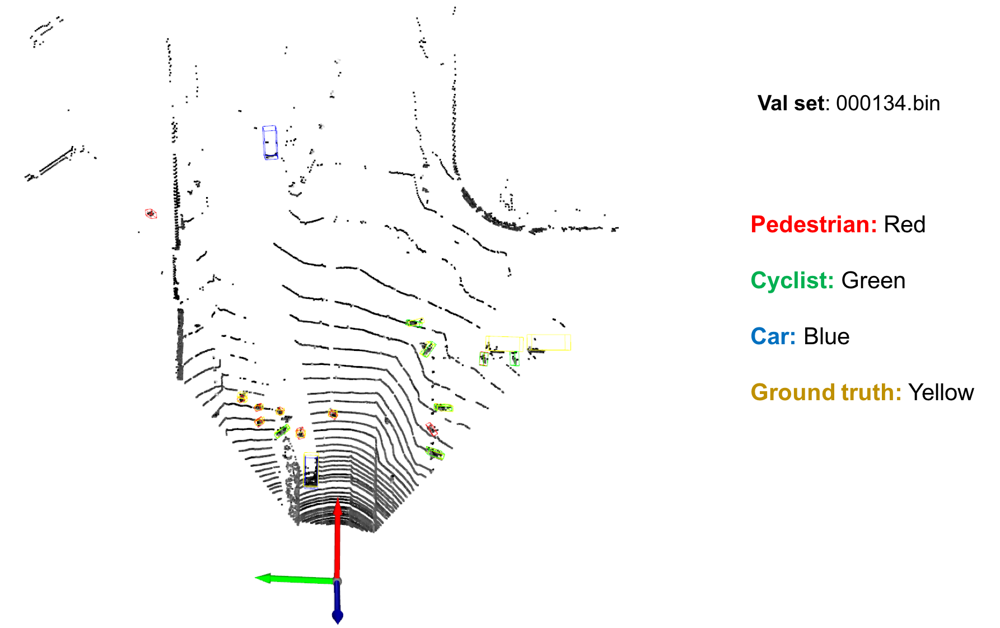

# [PointPillars: Fast Encoders for Object Detection from Point Clouds](https://arxiv.org/abs/1812.05784) 

A Simple PointPillars PyTorch Implenmentation for 3D Lidar(KITTI) Detection. [[Zhihu](https://zhuanlan.zhihu.com/p/521277176)]

- It can be run without installing [Spconv](https://github.com/traveller59/spconv), [mmdet](https://github.com/open-mmlab/mmdetection) or [mmdet3d](https://github.com/open-mmlab/mmdetection3d). 
- Only one detection network (PointPillars) was implemented in this repo, so the code may be more easy to read. 
- Sincere thanks for the great open-souce architectures [mmcv](https://github.com/open-mmlab/mmcv), [mmdet](https://github.com/open-mmlab/mmdetection) and [mmdet3d](https://github.com/open-mmlab/mmdetection3d), which helps me to learn 3D detetion and implement this repo.

## mAP on KITTI validation set (Easy, Moderate, Hard)

| Repo | Metric | Overall | Pedestrian | Cyclist | Car |
| :---: | :---: | :---: | :---: | :---: | :---: |
| this repo | 3D-BBox | 73.3259 62.7834 59.6278 | 51.4642 47.9446 43.8040 | 81.8677 63.6617 60.9126 | 86.6456 76.7439 74.1668 | 
| [mmdet3d v0.18.1](https://github.com/open-mmlab/mmdetection3d/tree/v0.18.1) | 3D-BBox  | 72.0537, 60.1114, 55.8320 | 52.0263, 46.4037, 42.4841 | 78.7231, 59.9526, 57.2489 | 85.4118, 73.9780, 67.7630 |
| this repo | BEV | 77.8540 69.8003 66.6699 | 59.1687 54.3456 50.5023 | 84.4268 67.1409 63.7409 | 89.9664 87.9145 85.7664 | 
| [mmdet3d v0.18.1](https://github.com/open-mmlab/mmdetection3d/tree/v0.18.1) | BEV | 76.6485, 67.7609, 64.5605 | 59.0778, 53.3638, 48.4230 | 80.9328, 63.3447, 60.0618 | 89.9348, 86.5743, 85.1967 |
| this repo | 2D-BBox | 80.5097 74.6120 71.4758 | 64.6249 61.4201 57.5965 | 86.2569 73.0828 70.1726 | 90.6471 89.3330 86.6583 |
| [mmdet3d v0.18.1](https://github.com/open-mmlab/mmdetection3d/tree/v0.18.1) | 2D-BBox | 78.4938, 73.4781, 70.3613 | 62.2413, 58.9157, 55.3660 | 82.6460, 72.3547, 68.4669 | 90.5939, 89.1638, 87.2511 |
| this repo | AOS | 74.9647 68.1712 65.2817 | 49.3777 46.7284 43.8352 | 85.0412 69.1024 66.2801 | 90.4752 88.6828 85.7298 |
| [mmdet3d v0.18.1](https://github.com/open-mmlab/mmdetection3d/tree/v0.18.1) | AOS | 72.41, 66.23, 63.55 | 46.00, 43.22, 40.94 | 80.85, 67.20, 63.63 | 90.37, 88.27, 86.07 |

- **Note: Here, we report [mmdet3d v0.18.1](https://github.com/open-mmlab/mmdetection3d/tree/v0.18.1) (2022/02/09-2022/03/01) performance based on the officially provided [checkpoint](https://github.com/open-mmlab/mmdetection3d/tree/v0.18.1/configs/pointpillars#kitti). Much improvements were made in the [mmdet3d v1.0.0rc1](https://github.com/open-mmlab/mmdetection3d/tree/v1.0.0rc1)**. 

## Detection Visualization




## [Compile] 

```
cd ops
python setup.py develop
```

## [Datasets]

1. Download

    Download [point cloud](https://s3.eu-central-1.amazonaws.com/avg-kitti/data_object_velodyne.zip)(29GB), [images](https://s3.eu-central-1.amazonaws.com/avg-kitti/data_object_image_2.zip)(12 GB), [calibration files](https://s3.eu-central-1.amazonaws.com/avg-kitti/data_object_calib.zip)(16 MB)和[labels](https://s3.eu-central-1.amazonaws.com/avg-kitti/data_object_label_2.zip)(5 MB)。Format the datasets as follows:
    ```
    kitti
        |- training
            |- calib (#7481 .txt)
            |- image_2 (#7481 .png)
            |- label_2 (#7481 .txt)
            |- velodyne (#7481 .bin)
        |- testing
            |- calib (#7518 .txt)
            |- image_2 (#7518 .png)
            |- velodyne (#7418 .bin)
    ```

2. Pre-process KITTI datasets First

    ```
    cd PointPillars/
    python pre_process_kitti.py --data_root your_path_to_kitti
    ```

    Now, we have datasets as follows:
    ```
    kitti
        |- training
            |- calib (#7481 .txt)
            |- image_2 (#7481 .png)
            |- label_2 (#7481 .txt)
            |- velodyne (#7481 .bin)
            |- velodyne_reduced (#7481 .bin)
        |- testing
            |- calib (#7518 .txt)
            |- image_2 (#7518 .png)
            |- velodyne (#7518 .bin)
            |- velodyne_reduced (#7518 .bin)
        |- kitti_gt_database (# 19700 .bin)
        |- kitti_infos_train.pkl
        |- kitti_infos_val.pkl
        |- kitti_infos_trainval.pkl
        |- kitti_infos_test.pkl
        |- kitti_dbinfos_train.pkl
    
    ```

## [Training]

```
cd PointPillars/
python train.py --data_root your_path_to_kitti
```

## [Evaluation]

```
cd PointPillars/
python evaluate.py --ckpt pretrained/epoch_160.pth --data_root your_path_to_kitti 
```

## [Test]

```
cd PointPillars/

# 1. infer and visualize point cloud detection
python test.py --ckpt pretrained/epoch_160.pth --pc_path your_pc_path 

# 2. infer and visualize point cloud detection and gound truth.
python test.py --ckpt pretrained/epoch_160.pth --pc_path your_pc_path --calib_path your_calib_path  --gt_path your_gt_path

# 3. infer and visualize point cloud & image detection
python test.py --ckpt pretrained/epoch_160.pth --pc_path your_pc_path --calib_path your_calib_path --img_path your_img_path


e.g. [infer on val set 000134]

python test.py --ckpt pretrained/epoch_160.pth --pc_path /home/lifa/data/KITTI/training/velodyne_reduced/000134.bin

or

python test.py --ckpt pretrained/epoch_160.pth --pc_path /home/lifa/data/KITTI/training/velodyne_reduced/000134.bin --calib_path /home/lifa/data/KITTI/training/calib/000134.txt --img_path /home/lifa/data/KITTI/training/image_2/000134.png --gt_path /home/lifa/data/KITTI/training/label_2/000134.txt

```

## Acknowledements

Thanks for the open souce code [mmcv](https://github.com/open-mmlab/mmcv), [mmdet](https://github.com/open-mmlab/mmdetection) and [mmdet3d](https://github.com/open-mmlab/mmdetection3d).
